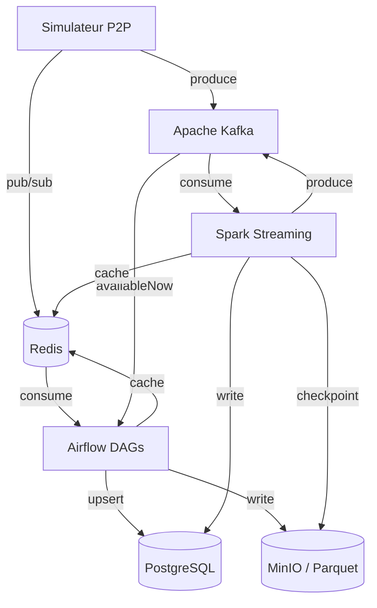

# Architecture SPOTIFY

> **À compléter par votre groupe** — Ce document doit décrire VOTRE architecture, pas celle de référence.

---

## Vision d'ensemble

```
[Insérer ici votre diagramme d'architecture]
Outil recommandé : draw.io, Excalidraw, ou Mermaid (ci-dessous)
```



---

## Décisions architecturales

### ETL vs ELT — Mapping par pipeline

| Pipeline | Approche | Justification |
|----------|----------|---------------|
| `catalog_ingestion` | **ETL** | Les données JSON des labels sont validées et normalisées en Python (noms d'artistes, dédoublonnage, vérification des champs) **avant** d'être insérées dans PostgreSQL. La transformation hors-base est nécessaire car le schéma PostgreSQL est strict (UNIQUE, NOT NULL). |
| `streaming_events` | **ETL** | Le simulateur P2P enrichit chaque événement (ajout device_type, geo_country, event_source) **avant** de le publier dans Redis/Kafka. L'événement arrive déjà structuré dans la base. |
| `aggregation` | **ELT** | Les `listening_events` sont déjà dans PostgreSQL. Les agrégats (`daily_streams`, `artist_stats`) sont calculés directement par des requêtes SQL (`GROUP BY`, `COUNT`). On charge d'abord, on transforme ensuite dans la base. |
| `recommendation` | **ELT** | Les données d'écoute sont dans PostgreSQL. Le scoring est calculé par des requêtes SQL de fréquence, puis le résultat est mis en cache dans Redis. Transformation dans la base, pas en dehors. |
| `dlq_reprocessing` | **ETL** | Les événements de la DLQ sont relus, re-validés et re-transformés en Python **avant** d'être réinjectés dans le pipeline principal. |
| `streaming_trends` (Spark) | **ELT** | Spark lit les messages bruts depuis Kafka (**Extract + Load en mémoire**), applique les fenêtres temporelles et agrégations en mémoire distribuée (**Transform**), puis écrit dans PostgreSQL et Redis. C'est un ELT in-memory : la transformation se fait dans le moteur de traitement, pas dans la base destination. |

### Partitionnement Parquet

Expliquer ici votre stratégie de partitionnement des fichiers Parquet sur MinIO.

```
spotify-parquet/
└── listening_events/
    └── date=2025-01-15/
        └── hour=14/
            └── part-00000.parquet
```

**Pourquoi cette structure ?**
→ À compléter

### Topics Kafka — Stratégie de partitionnement

| Topic | Partitions | Clé | Justification |
|-------|-----------|-----|---------------|
| listening_events | 6 | user_id | ... |
| p2p_network_events | 6 | peer_id | ... |
| catalog_updates | 3 | track_id | ... |
| fraud_alerts | 3 | user_id | ... |

**Pourquoi `user_id` comme clé pour `listening_events` ?**
→ À compléter

---

## Choix techniques

### Pourquoi CeleryExecutor (pas KubernetesExecutor) ?

→ À compléter

### Gestion des secrets

→ Comment votre groupe gère les credentials (PostgreSQL password, MinIO keys...) ?

---

## Architecture Lambda — Batch + Speed Layer

```
Speed layer  : Simulateur → Kafka → Spark → PostgreSQL (realtime_*) + Redis
Batch layer  : Simulateur → Kafka (availableNow) → Airflow → PostgreSQL (daily_*) + MinIO
Serving layer: PostgreSQL + Redis ← consommé par les clients
```

**Ce qui est en batch et pourquoi :**
→ À compléter

**Ce qui est en streaming et pourquoi :**
→ À compléter

---

## Schémas d'événements

### listening_event

```json
{
  "event_id":    "uuid",
  "user_id":     "uuid",
  "track_id":    "uuid",
  "source_peer": "uuid",
  "timestamp":   "2025-01-15T14:30:00Z",
  "duration_ms": 45000,
  "device_type": "mobile",
  "geo_country": "FR",
  "completed":   true,
  "event_source": "p2p"
}
```

### p2p_network_event

```json
{
  "event_id":   "uuid",
  "event_type": "chunk_transfer",
  "peer_id":    "uuid",
  "target_peer": "uuid",
  "track_id":   "uuid",
  "chunk_size_bytes": 65536,
  "latency_ms": 12,
  "timestamp":  "2025-01-15T14:30:01Z"
}
```

---

## Leçons apprises

> À compléter au fur et à mesure de la semaine.

- **Lundi** : ...
- **Mardi** : ...
- **Mercredi** : ...
- **Jeudi** : ...
- **Vendredi** : ...
