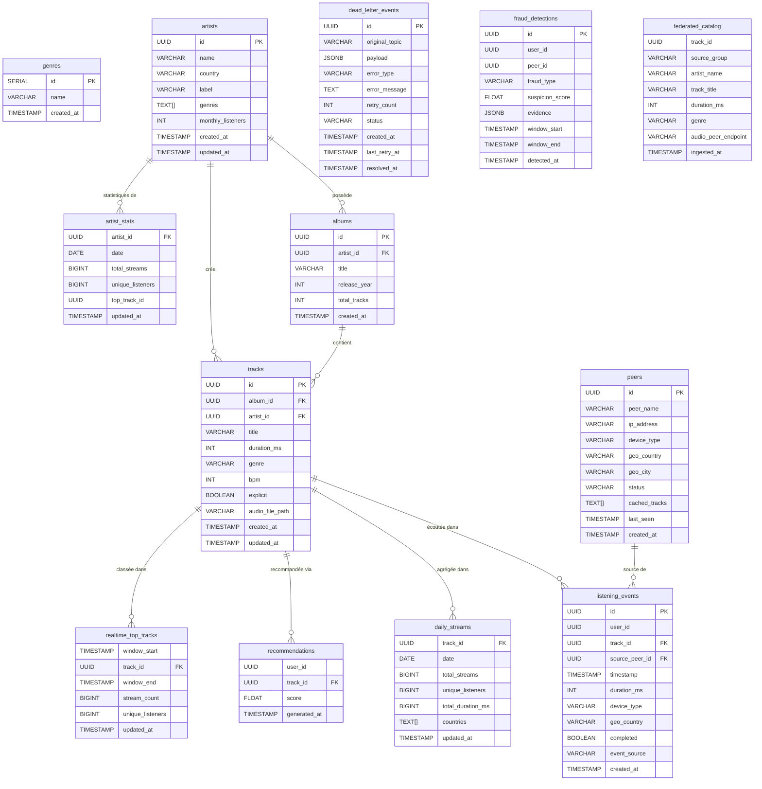

# DATA MODEL — SPOTIFY

## Diagramme ERD



---

## Index et justifications

### Table `listening_events`

```sql
CREATE INDEX idx_listening_events_user_id      ON listening_events(user_id);
CREATE INDEX idx_listening_events_track_id     ON listening_events(track_id);
CREATE INDEX idx_listening_events_timestamp    ON listening_events(timestamp);
CREATE INDEX idx_listening_events_ts_partition ON listening_events(date_trunc('hour', timestamp));
```

**Pourquoi deux index sur le timestamp ?**

L'index sur `timestamp` sert aux requêtes de **filtrage sur une plage de dates** :
```sql
-- "Tous les événements des 24 dernières heures"
WHERE timestamp >= NOW() - INTERVAL '24 hours'
```

L'index sur `date_trunc('hour', timestamp)` sert aux requêtes d'**agrégation par fenêtre temporelle** :
```sql
-- "Nombre d'écoutes par heure"
GROUP BY date_trunc('hour', timestamp)
```
Sans cet index fonctionnel, PostgreSQL recalcule `date_trunc` sur chaque ligne à chaque requête. Avec l'index, le résultat est pré-calculé et directement accessible — critique pour Spark qui génère ce type de requête en continu.

### Table `dead_letter_events`

```sql
CREATE INDEX idx_dlq_status     ON dead_letter_events(status);
CREATE INDEX idx_dlq_created_at ON dead_letter_events(created_at);
```

Ces deux index permettent au DAG `dlq_reprocessing_pipeline` de retrouver rapidement les événements `status = 'pending'` triés par date de création, sans scanner toute la table.

---

## `daily_streams` vs `realtime_top_tracks`

| | `daily_streams` | `realtime_top_tracks` |
|---|---|---|
| **Alimenté par** | Airflow DAG (`aggregation_pipeline`) | Spark Structured Streaming (`streaming_trends_job`) |
| **Fréquence de mise à jour** | 1 fois par jour (batch nocturne) | En continu, fenêtres glissantes de 5 minutes |
| **Précision** | Exacte — données complètes et finales | Approximative — données de la dernière fenêtre |
| **Granularité** | 1 ligne par `(track_id, date)` | 1 ligne par `(window_start, track_id)` |
| **Usage** | Rapports historiques, facturation, analytique | Dashboard "Trending Now", alertes temps réel |
| **Latence** | ~12-24h | ~5-30 secondes |

Ces deux tables coexistent dans une **architecture Lambda** : la couche batch produit des agrégats précis sur les données complètes, la couche streaming produit des approximations rapides pour l'affichage live. À terme, les deux devraient converger (réconciliation via `reconciliation_pipeline`).

---

## Pourquoi `payload` est JSONB et non TEXT

La table `dead_letter_events` stocke les messages originaux qui ont échoué dans le pipeline. Le champ `payload` contient le message brut (événement d'écoute, catalogue...).

**TEXT** stocke la chaîne brute, PostgreSQL ne connaît pas sa structure :
- Impossible de filtrer sur un champ interne : `WHERE payload LIKE '%user_id%'` est fragile et lent
- Aucune validation à l'insertion — un JSON malformé passe sans erreur
- Impossible d'indexer un champ imbriqué

**JSONB** (JSON Binaire) apporte trois avantages clés :
1. **Requêtable** — on peut filtrer et extraire des champs directement :
   ```sql
   WHERE payload->>'error_type' = 'schema_validation'
   WHERE payload->>'user_id' = '...'
   ```
2. **Validé** — PostgreSQL rejette tout JSON malformé à l'insertion, garantissant l'intégrité
3. **Indexable** — on peut créer un index GIN sur `payload` pour des recherches rapides dans les données JSON

Pour la DLQ, c'est essentiel : les ingénieurs doivent pouvoir **analyser les erreurs par type, par user, par topic** sans extraire toute la table.
